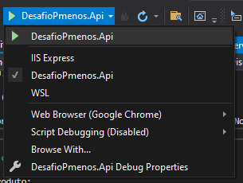
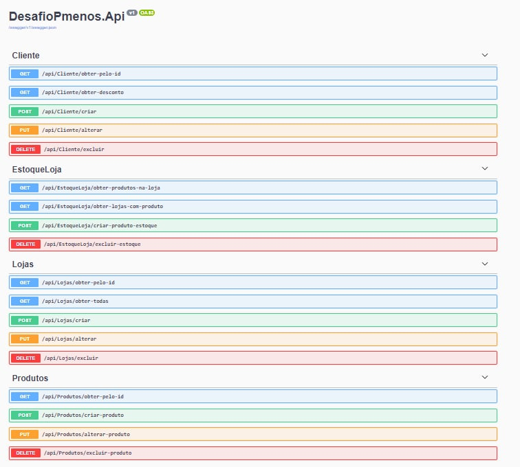
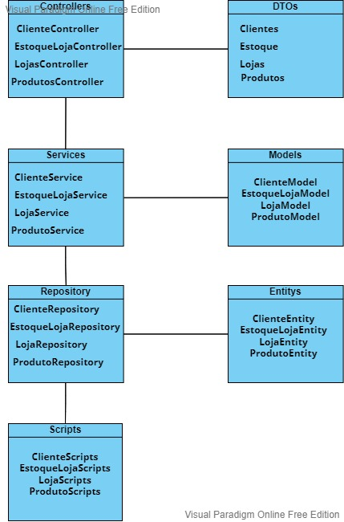
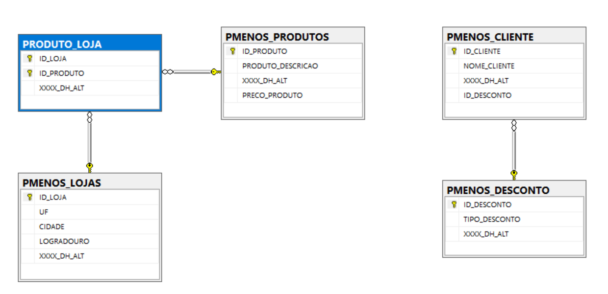

<h1 align="center"> DESAFIO PAGUE MENOS </h1>

## 💻 Pré-requisitos

Antes de começar, verifique se você atendeu aos seguintes requisitos:
* SDK 5.0 do Microsoft .NET instalada

## 🚀 Clonando projeto na sua máquina
Para clonar o repositório em sua máquina local, abra o git bash na pasta desejada e execute o comando git clone https://github.com/mariothiago/DESAFIO_PMENOS_NET.git

## :arrow_forward: Executando projeto na sua máquina
Utilizando o Visual Studio:
- Após clonar o repositório em sua máquina local, abra a solution DesafioPmenos.sln
- Na solution, procure a barra de executável do projeto (provavelmente estará setado para IIS Express com padrão)
- Altere o projeto para DesafioPmenos.Api como na imagem abaixo:
- 

- Execute e a página do swagger irá abrir automaticamente na porta 5001 como na imagem abaixo:
- 

## :triangular_ruler: Arquitetura da API
A arquitetura da API foi baseada no que é empregada na squad GC. Para melhor compreensão, foi feito diagrama abaixo:
- 

## 🛠 Tecnologias utilizadas
- [C# .NET 5.0](https://docs.microsoft.com/pt-br/dotnet/csharp/)
- [ASPNET Core](https://dotnet.microsoft.com/en-us/apps/aspnet)
- Dapper - ORM
- [SQL Server](https://www.microsoft.com/pt-br/sql-server/sql-server-2019)
- [Swagger](https://swagger.io/)

## :game_die: Modelagem de Dados
Utilizando o modelo entidade-relacionamento, foi produzido o seguinte diagrama no SQL Server:

## 📝 Sobre o projeto
Esse projeto tem como objetivo desenvolver um sistema básico de gerenciamento das seguintes informações:
Lojas, Produtos, Estoques e Preços.

Os requisitos básicos do sistema são:
- [x] Cadastro de produtos
- [x] Cadastro de lojas
- [x] Buscar produtos
- [x] Buscar lojas
- [x] Atualizar lojas
- [x] Deletar produtos
- [x] Deletar lojas
- [x] Buscar produtos por loja

## :gem: Bônus:
- [x] Incluir a entidade/tabela cliente
- [x] Incluir a entidade/tabela desconto
- [x] Relacionar o desconto ao usuário, sendo este desconto aplicado sobre o preço de
um produto ao consultar o item de uma loja informando o ID do cliente
- [ ] Os usuários poderão ver quais descontos estão disponíveis
